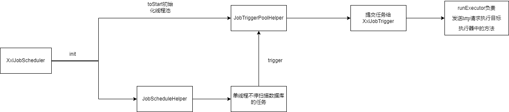

继续改造调度中心代码，在JobScheduleHelper类中定义一个私有的scheduleThread线程对象。并且，该类中还定义了一个start方法，当该方法被调用的时候，调度模块中调度定时任务的线程就开始工作了。该线程会在一个循环中不停地查找数据库中所有的定时任务信息，然后判断每个定时任务是否到了执行的时间，如果到达执行的时间，就让线程去远程通知定时任务程序执行定时任务

```java
public class JobScheduleHelper {

    //调度定时任务的线程
    private Thread scheduleThread;

    //创建当前类的对象
    private static JobScheduleHelper instance = new JobScheduleHelper();

    //把当前类的对象暴露出去
    public static JobScheduleHelper getInstance(){
        return instance;
    }

    //启动调度线程工作的方法
    public void start(){
  
      scheduleThread = new Thread(new Runnable() {
            @Override
            public void run() {
                 while (true) {
                     //从数据库中查询所有定时任务信息
            		 List<XxlJobInfo> jobInfoList = findAll();
            		 //得到当前时间
            		 long time = System.currentTimeMillis();
            		 //遍历所有定时任务信息
                     for (XxlJobInfo jobInfo : jobInfoList) {
                         if (time >= jobInfo.getTriggerNextTime) {
                             //如果大于就执行定时任务，在这里就选用集合的第一个地址
                    		 String address = jobInfo.getRegistryList().get(0);
                    		 //通过网络，远程通知定时任务执行
                			 System.out.println("通知address服务器，去执行定时任务!");
                    		 //计算定时任务下一次的执行时间
                    		 Date nextTime = new CronExpression(scheduleCron).getNextValidTimeAfter(new Date());
                    		 //下面就是更新数据库中定时任务的操作
                    		 XxlJobInfo job = new XxlJobInfo();
                    		 job.setExecutorHandler(selfishHeart);
                    		 job.setTriggerNextTime(nextTime.getTime());
                    		 save(job);
                         }
                     }
                 }
            }
        });  
      //启动调度线程
      scheduleThread.start();
    }
}
```

为调度模块添加了一个启动类。同时，我也正式给调度模块更名为调度中心。请看下面的代码。

```java
public class XxlJobScheduler {

    private static final Logger logger = LoggerFactory.getLogger(XxlJobScheduler.class);

    //初始化调度中心组件的方法
    public void init() throws Exception {
        //在这里调度定时任务的线程被启动了
        JobScheduleHelper.getInstance().start();
    }
}
```

下面，我再创建一个测试类，启动调度中心的程序。

```java
public class Test {

    public static void main(String[] args) {
        //创建调度中心
       XxlJobScheduler xxlJobScheduler = new XxlJobScheduler();
       //初始化调度中心组件
       xxlJobScheduler.init();
	}
}
```

调度中心如果判断有定时任务要执行了，该怎么远程通知给执行定时任务的程序呢?

该用什么对象封装什么信息呢？封装的这个信息是我最关心的。什么信息可以成为调度中心和定时任务执行程序中判别唯一定时任务的标准呢？其实很简单，就是定时任务方法的名字。虽然啊一个定时任务程序中可能会定义多个定时任务，但是每个定时任务方法的名称是唯一的，所以，调度中心只要把要执行的定时任务方法的名称发送给定时任务执行程序即可。并且这个方法名称同样可以封装在一个对象中，既然是要触发定时任务了，这个对象就可以定义为TriggerParam，意思就是触发参数。请看下面的代码块。

```java
public class TriggerParam implements Serializable{
    private static final long serialVersionUID = 42L;

    //定时任务方法的名字
    private String executorHandler;

    public String getExecutorHandler() {
        return executorHandler;
    }

    public void setExecutorHandler(String executorHandler) {
        this.executorHandler = executorHandler;
    }

}

```

这样一来，调度中心只要通过网络把封装着要执行的定时任务名字的TriggerParam对象发送给定时任务执行程序，这样，定时任务执行程序接收到消息后，就可以从TriggerParam对象中获得要执行的任务名称，然后直接去执行即可。当然，这个过程也很复杂，在后面的章节中我再给大家细讲。总之，现在我的调度中心终于有了可以向定时任务执行器发送的消息了。所以，我现在就想再次把我的调度中心的核心类重构一下，也就是重构JobScheduleHelper类中的start方法。请看下面的代码块。

```java
public class JobScheduleHelper {

    //调度定时任务的线程
    private Thread scheduleThread;

    //创建当前类的对象
    private static JobScheduleHelper instance = new JobScheduleHelper();

    //把当前类的对象暴露出去
    public static JobScheduleHelper getInstance(){
        return instance;
    }

    //启动调度线程工作的方法
    public void start(){
  
      scheduleThread = new Thread(new Runnable() {
            @Override
            public void run() {
                 while (true) {
                     //从数据库中查询所有定时任务信息
            		 List<XxlJobInfo> jobInfoList = findAll();
            		 //得到当前时间
            		 long time = System.currentTimeMillis();
            		 //遍历所有定时任务信息
                     for (XxlJobInfo jobInfo : jobInfoList) {
                         if (time >= jobInfo.getTriggerNextTime) {
                             //如果大于就执行定时任务，就调用下面这个方法，开始远程通知定时任务程序
                             //执行定时任务
                             //注意，这里引入了一个新的类，JobTriggerPoolHelper
                    		 JobTriggerPoolHelper.trigger(jobInfo);
                    		 //计算定时任务下一次的执行时间
                    		 Date nextTime = new CronExpression(scheduleCron).getNextValidTimeAfter(new Date());
                    		 //下面就是更新数据库中定时任务的操作
                    		 XxlJobInfo job = new XxlJobInfo();
                    		 job.setExecutorHandler(selfishHeart);
                    		 job.setTriggerNextTime(nextTime.getTime());
                    		 save(job);
                         }
                     }
                 }
            }
        });  
      //启动调度线程
      scheduleThread.start();
    }
}
```

在上面的代码块中，我在远程通知执行定任务的程序的操作处做了一点变动，引入了一个新的名为JobTriggerPoolHelper的新类，这个类中的trigger方法，就是用来远程通知定时任务执行器执行定时任务的。

## 引入新类JobTriggerPoolHelper

现在，我请大家具体看一看JobTriggerPoolHelper这个类内部的构造。请看下面的代码。

```java
public class JobTriggerPoolHelper {

    private static Logger logger = LoggerFactory.getLogger(JobTriggerPoolHelper.class);

	public static void trigger(XxlJobInfo jobInfo) {
    	//helper其实就是该类的单例对象
        //只是我这里没有把对象列出来而已
        helper.addTrigger(jobInfo);
    }


    public void  addTrigger(XxlJobInfo jobInfo) {
        //这是我引入的新的类
        XxlJobTrigger.trigger(jobInfo);
    }
  
}
```

## 引入新类XxlJobTrigger

上面的代码块很简单，当然，就目前来说，真的十分简单。因为我的调度中心要去触发定时任务，让定时任务执行了，所以我就又搞了一个触发任务的类，这个类就负责把定时任务的信息向程序内部继续传递下去。在JobScheduleHelper类中调用了JobTriggerPoolHelper.trigger(jobInfo)方法后，程序就会来到JobTriggerPoolHelper类中，调用该类的trigger方法，接着又会调用该类的addTrigger方法，在该方法中，程序就来到了我又引入的新的XxlJobTrigger类中，这个类就是用来真正触发定时任务远程调用的。请大家看下面的代码块。

```java
public class XxlJobTrigger {

    private static Logger logger = LoggerFactory.getLogger(XxlJobTrigger.class);

    public static void trigger(XxlJobInfo jobInfo) {
        processTrigger(jobInfo);
    }

     private static void processTrigger(XxlJobInfo jobInfo){
        //初始化触发器参数，这里的这个触发参数，是要在远程调用的另一端，也就是定时任务执行程序那一端使用的
        TriggerParam triggerParam = new TriggerParam();
        //设置执行器要执行的任务的方法名称
        triggerParam.setExecutorHandler(jobInfo.getExecutorHandler());
         //选择具体的定时任务执行器地址，这里默认使用集合中的第一个
        String address = jobInfo.getRegistryList().get(0);
         //在这里执行远程调用，也就是把要执行的定时任务的执行信息发送给定时任务程序
         //现在，
        triggerResult = runExecutor(triggerParam, address);
  
    }


    public static ReturnT<String> runExecutor(TriggerParam triggerParam, String address){
       //在这个方法中把消息发送给定时任务执行程序，具体怎么发送，我暂不实现
    }
}
```

接下来，就该看看现在程序中，最需要实现的一个功能了，就是怎样把定时任务信息发送给定时任务执行程序。如果信息发送不成功，那么前面设计的一切都白搭。

让我来仔细想一想，其实在网络通信中，所做的所有操作都是为了发送消息而已，消息发送过去之后，再用解码器解析消息。然后程序根据收到的消息执行具体的操作，这些操作就是程序员的工作了。而发送消息时肯定需要使用某些协议，消息按照规定的协议进行编码，被接收到之后再按照规定的协议解码。既然是这样，那我不妨就使用http协议来进行通信，反正是发送消息，就用http协议把要发送的消息发送个定时任务执行程序，定时任务执行程序接收到消息后，再解析http协议，获得调度中心发送的TriggerParam对象，取出对象中封装的定时任务的名称，接着去执行定时任务就行了。至于具体怎么执行，这是后面课程的内容，这里就先不讲解了。当然，既然是http协议传输消息，有请求自然就会有响应，再说，定时任务执行结果成功还是失败，我这个调度中心也十分关心呀。所以，如果定时任务执行成功了，就把执行结果放在响应中回复给调度中心。如果大家都清楚这个逻辑了，那么，下面请看我重构之后的程序。

我把发送定时任务信息方法的逻辑定义在了XxlJobTrigger类中的runExecutor方法中，但是该方法刚才并没有实现，现在，我就为自己的调度中心实现一下。请看下面的代码块。

```java
public class XxlJobTrigger {

    private static Logger logger = LoggerFactory.getLogger(XxlJobTrigger.class);

    public static void trigger(XxlJobInfo jobInfo) {
        processTrigger(jobInfo);
    }

     private static void processTrigger(XxlJobInfo jobInfo){
        //初始化触发器参数，这里的这个触发参数，是要在远程调用的另一端，也就是定时任务执行程序那一端使用的
        TriggerParam triggerParam = new TriggerParam();
        //设置执行器要执行的任务的方法名称
        triggerParam.setExecutorHandler(jobInfo.getExecutorHandler());
         //选择具体的定时任务执行器地址，这里默认使用集合中的第一个
        String address = jobInfo.getRegistryList().get(0);
         //在这里执行远程调用，也就是把要执行的定时任务的执行信息发送给定时任务程序，定时任务
         //程序执行完毕后，返回一个执行结果信息，封装在ReturnT对象中
        //这个ReturnT类下面就有解释，是用来封装定时任务程序的返回信息的类
       ReturnT<String> triggerResult = runExecutor(triggerParam, address);
         //就在这里输出一下状态码吧，根据返回的状态码判断任务是否执行成功
        logger.info("返回的状态码"+triggerResult.getCode());
  
    }


    public static ReturnT<String> runExecutor(TriggerParam triggerParam, String address){
       //在这个方法中把消息发送给定时任务执行程序
        HttpURLConnection connection = null;
        BufferedReader bufferedReader = null;
        try {
            //创建链接
            URL realUrl = new URL(address);
            //得到连接
            connection = (HttpURLConnection) realUrl.openConnection();
            //设置连接属性
            //post请求
            connection.setRequestMethod("POST");
            connection.setDoOutput(true);
            connection.setDoInput(true);
            connection.setUseCaches(false);
            connection.setReadTimeout(3 * 1000);
            connection.setConnectTimeout(3 * 1000);
            connection.setRequestProperty("connection", "Keep-Alive");
            connection.setRequestProperty("Content-Type", "application/json;charset=UTF-8");
            connection.setRequestProperty("Accept-Charset", "application/json;charset=UTF-8");
            //进行连接
            connection.connect();
            //判断请求体是否为null
            if (triggerParam != null) {
                //序列化请求体，也就是要发送的触发参数
                String requestBody = GsonTool.toJson(triggerParam);
                //下面就开始正式发送消息了
                DataOutputStream dataOutputStream = new DataOutputStream(connection.getOutputStream());
                dataOutputStream.write(requestBody.getBytes("UTF-8"));
                //刷新缓冲区
                dataOutputStream.flush();
                //释放资源
                dataOutputStream.close();
            }
            //获取响应码
            int statusCode = connection.getResponseCode();
            if (statusCode != 200) {
                //设置失败结果
                return new ReturnT<String>(ReturnT.FAIL_CODE, "xxl-job remoting fail, StatusCode("+ statusCode +") invalid. for url : " + url);
            }
            //下面就开始接收返回的结果了
            bufferedReader = new BufferedReader(new InputStreamReader(connection.getInputStream(), "UTF-8"));
            StringBuilder result = new StringBuilder();
            String line;
            //接收返回信息
            while ((line = bufferedReader.readLine()) != null) {
                result.append(line);
            }
            //转换为字符串
            String resultJson = result.toString();
            try {
                //转换为ReturnT对象，返回给用户
                ReturnT returnT = GsonTool.fromJson(resultJson, ReturnT.class, returnTargClassOfT);
                return returnT;
            } catch (Exception e) {
                logger.error("xxl-job remoting (url="+url+") response content invalid("+ resultJson +").", e);
                return new ReturnT<String>(ReturnT.FAIL_CODE, "xxl-job remoting (url="+url+") response content invalid("+ resultJson +").");
            }
        } catch (Exception e) {
            logger.error(e.getMessage(), e);
            return new ReturnT<String>(ReturnT.FAIL_CODE, "xxl-job remoting error("+ e.getMessage() +"), for url : " + url);
        } finally {
            try {
                if (bufferedReader != null) {
                    bufferedReader.close();
                }
                if (connection != null) {
                    connection.disconnect();
                }
            } catch (Exception e2) {
                logger.error(e2.getMessage(), e2);
            }
        }
    }
}
```

下面的代码块就是ReturnT类的具体内容，可以看到，定时任务的执行结果就封装在里面。

```java
public class ReturnT<T> implements Serializable {
	public static final long serialVersionUID = 42L;

	public static final int SUCCESS_CODE = 200;
	public static final int FAIL_CODE = 500;

    //执行结果，如果成功就返回SUCCESS对象
	public static final ReturnT<String> SUCCESS = new ReturnT<String>(null);
    //失败就返回FAIL对象。这两个对象都是ReturnT类型的
	public static final ReturnT<String> FAIL = new ReturnT<String>(FAIL_CODE, null);


	private int code;
	private String msg;
	private T content;

	public ReturnT(){}
	public ReturnT(int code, String msg) {
		this.code = code;
		this.msg = msg;
	}
	public ReturnT(T content) {
		this.code = SUCCESS_CODE;
		this.content = content;
	}

	public int getCode() {
		return code;
	}
	public void setCode(int code) {
		this.code = code;
	}
	public String getMsg() {
		return msg;
	}
	public void setMsg(String msg) {
		this.msg = msg;
	}
	public T getContent() {
		return content;
	}
	public void setContent(T content) {
		this.content = content;
	}

	@Override
	public String toString() {
		return "ReturnT [code=" + code + ", msg=" + msg + ", content=" + content + "]";
	}

}

```

## 性能优化-引入线程池

现在我的程序已经达到了一个小圆满的状态，能够通过http协议，让调度中心和定时任务执行程序进行沟通了。但是，请大家仔细想一想，现在的程序中，主要是谁在干活？干的什么活？因为说到底，设计一个程序不能只考虑程序的运行，还要尽可能考虑程序的性能。当运行没有问题的时候，提高性能就成为最主要的问题了。那我目前的调度中心，性能如何，性能的瓶颈又在哪里呢？其实已经很明显了，目前的调度中心中，按照我现在的编码流程，所有的活实际上都是JobScheduleHelper类中的scheduleThread线程在干。请大家再次回顾一下JobScheduleHelper类的内容。

```java
public class JobScheduleHelper {

    //调度定时任务的线程
    private Thread scheduleThread;

    //创建当前类的对象
    private static JobScheduleHelper instance = new JobScheduleHelper();

    //把当前类的对象暴露出去
    public static JobScheduleHelper getInstance(){
        return instance;
    }

    //启动调度线程工作的方法
    public void start(){
  
      scheduleThread = new Thread(new Runnable() {
            @Override
            public void run() {
                 while (true) {
                     //从数据库中查询所有定时任务信息
            		 List<XxlJobInfo> jobInfoList = findAll();
            		 //得到当前时间
            		 long time = System.currentTimeMillis();
            		 //遍历所有定时任务信息
                     for (XxlJobInfo jobInfo : jobInfoList) {
                         if (time >= jobInfo.getTriggerNextTime) {
                             //如果大于就执行定时任务，就调用下面这个方法，开始远程通知定时任务程序
                             //执行定时任务
                             //注意，这里引入了一个新的类，JobTriggerPoolHelper
                    		 JobTriggerPoolHelper.trigger(jobInfo);
                    		 //计算定时任务下一次的执行时间
                    		 Date nextTime = new CronExpression(scheduleCron).getNextValidTimeAfter(new Date());
                    		 //下面就是更新数据库中定时任务的操作
                    		 XxlJobInfo job = new XxlJobInfo();
                    		 job.setExecutorHandler(selfishHeart);
                    		 job.setTriggerNextTime(nextTime.getTime());
                    		 save(job);
                         }
                     }
                 }
            }
        });  
      //启动调度线程
      scheduleThread.start();
    }
}
```

可以看到，在JobScheduleHelper中，一旦start方法被调用了，scheduleThread线程就会启动，然后在一个循环中不停地扫描数据库，调度任务去执行。并且，调度任务去执行时，最终会一路调用到XxlJobTrigger类中的runExecutor方法，在该方法中，会通过http协议，把封装好定时任务信息的对象发送给定时任务执行程序，并且——注意这里是必须要强调清楚的——scheduleThread会等待定时任务程序执行完定时任务后把执行的结果回复过来。如果定时任务执行的时间过长，那scheduleThread线程不就会一直阻塞在这里等待响应结果吗？如果一直阻塞在这里，数据库中的后续任务还怎么调度啊？显然，这是一个十分严重的问题，问题的严重性不亚于你抛弃自尊，当女人的舔狗！那该怎么解决呢？其实解决的方法也很简单，在生活中，我总对自己和媳妇说多一事不如少一事，但是在编程中，我总是听见程序对我说，少一个不如多一个。道理就是这么简单，既然一个线程根本忙不过来，那就再创建一个新的线程就好了。让这个新的线程把定时任务信息远程发送给执行定时任务的程序。就像下面这样。

```java
//启动调度线程工作的方法
    public void start(){
  
      scheduleThread = new Thread(new Runnable() {
            @Override
            public void run() {
                 while (true) {
                     //从数据库中查询所有定时任务信息
            		 List<XxlJobInfo> jobInfoList = findAll();
            		 //得到当前时间
            		 long time = System.currentTimeMillis();
            		 //遍历所有定时任务信息
                     for (XxlJobInfo jobInfo : jobInfoList) {
                         if (time >= jobInfo.getTriggerNextTime) {
                             //在这里创建了一个新的线程去远程调度定时任务
                             //并且等待定时任务执行结果的信息
                             new Thread(new Runnable() {
                                        @Override
                                        public void run() {
                                            //这里就是远程调用的方法
                                             JobTriggerPoolHelper.trigger(jobInfo);
                                        }
                                    }).start();
                    		 //计算定时任务下一次的执行时间
                    		 Date nextTime = new CronExpression(scheduleCron).getNextValidTimeAfter(new Date());
                    		 //下面就是更新数据库中定时任务的操作
                    		 XxlJobInfo job = new XxlJobInfo();
                    		 job.setExecutorHandler(selfishHeart);
                    		 job.setTriggerNextTime(nextTime.getTime());
                    		 save(job);
                         }
                     }
                 }
            }
        });  
      //启动调度线程
      scheduleThread.start();
    }
```

在上面的代码块中，我并不让scheduleThread干所有的活了，而是创建了一个线程为它分担工作，现在的情形就变成了scheduleThread线程循环扫描数据库，判断哪个定时任务可以去执行了，就让新创建的线程去远程调用定时任务，同步等待http的响应。这样的话，即便定时任务执行比较耗时，阻塞的也是新创建的线程，调度线程scheduleThread依然可以正常工作。写到这里，我知道肯定会有朋友说，按照上面代码的逻辑，不就是每调度一个定时任务，就要创建一个新的线程了吗？不错，目前的程序就是这样运行的，每调度一个定时任务，就要创建一个新的线程。请大家想一想，调度中心维护的数据库中所有的定时任务信息，就是整个程序要执行的定时任务，每一个定时任务都是独立的个体，谁也不会干涉谁，所以，调度的时候，自然就是每个定时任务都需要一个线程去远程执行。如果这样有点理解不了，那我请问你，当你去洗脚的时候，点了个钟，你是希望单独给你分配一个按脚师傅或者按脚老妹呢？还是让按脚师傅给你按十分钟，然后去给别人按十分钟，再接着给你按十分钟呢？你要是脑子没毛病，肯定希望直接给你按满一个小时，对吧？你是这么想的，定时任务也是这么想的，所以，它很希望有一个单独的线程专门执行它。

接下来肯定就会有朋友说，如果是这样的话，要调度的定时任务很多的情况下，调度中心岂不是要创建很多线程？这样岂不是会消耗很多资源。既然这样，那就让定时任务被远程执行完以后，新创建的线程接收到http的响应后，直接销毁不就完了。当然，你可能会说，销毁线程更消耗时间啊！是啊，我也知道频繁销毁线程更消耗资源，我也只是说说，并没有真的要这么做的意思。其实我早就想好了，既然频繁创建线程和销毁线程是很不理智的操作，但是线程又必须创建，那不如直接搞一个线程池好了，直接复用线程，不就什么都解决了？既然这样，那我就用线程池再重构一下我的程序吧！

首先是JobScheduleHelper类。我让它回归到本来面目了。

```java
public class JobScheduleHelper {

    //调度定时任务的线程
    private Thread scheduleThread;

    //创建当前类的对象
    private static JobScheduleHelper instance = new JobScheduleHelper();

    //把当前类的对象暴露出去
    public static JobScheduleHelper getInstance(){
        return instance;
    }

    //启动调度线程工作的方法
    public void start(){
  
      scheduleThread = new Thread(new Runnable() {
            @Override
            public void run() {
                 while (true) {
                     //从数据库中查询所有定时任务信息
            		 List<XxlJobInfo> jobInfoList = findAll();
            		 //得到当前时间
            		 long time = System.currentTimeMillis();
            		 //遍历所有定时任务信息
                     for (XxlJobInfo jobInfo : jobInfoList) {
                         if (time >= jobInfo.getTriggerNextTime) {
                             //如果大于就执行定时任务，就调用下面这个方法，开始远程通知定时任务程序
                             //执行定时任务
                    		 JobTriggerPoolHelper.trigger(jobInfo);
                    		 //计算定时任务下一次的执行时间
                    		 Date nextTime = new CronExpression(scheduleCron).getNextValidTimeAfter(new Date());
                    		 //下面就是更新数据库中定时任务的操作
                    		 XxlJobInfo job = new XxlJobInfo();
                    		 job.setExecutorHandler(selfishHeart);
                    		 job.setTriggerNextTime(nextTime.getTime());
                    		 save(job);
                         }
                     }
                 }
            }
        });  
      //启动调度线程
      scheduleThread.start();
    }
}
```

我把新创建的线程取消了，仍然是直接把定时任务的信息交给JobTriggerPoolHelper类的trigger方法，这是因为我打算把线程池创建在JobTriggerPoolHelper类中，这样，具体的操作就可以在JobTriggerPoolHelper类中进行了。请大家看一下重构之后的JobTriggerPoolHelper类。

```java
public class JobTriggerPoolHelper {

    private static Logger logger = LoggerFactory.getLogger(JobTriggerPoolHelper.class);

    //在这里创建线程池， 用于远程调用定时任务
    private ThreadPoolExecutor triggerPool = null;

    //创建该类的对象
    private static JobTriggerPoolHelper helper = new JobTriggerPoolHelper();

    //对外暴露的该类线程池的方法
    public static void toStart() {
        helper.start();
    }

    //对外暴露终止该类线程池的方法
    public static void toStop() {
        helper.stop();
    }

     public void start(){
        //在这里创建线程池，最大线程数为150
        triggerPool = new ThreadPoolExecutor(
                10,
                150,
                60L,
                TimeUnit.SECONDS,
                new LinkedBlockingQueue<Runnable>(1000),
                new ThreadFactory() {
                    @Override
                    public Thread newThread(Runnable r) {
                        return new Thread(r, "xxl-job, admin JobTriggerPoolHelper-fastTriggerPool-" + r.hashCode());
                    }
        		});
    }


    //终止线程池的方法
    public void stop() {
        triggerPool.shutdownNow();
    }

	//该方法并没什变动
    public static void trigger(XxlJobInfo jobInfo) {

        helper.addTrigger(jobInfo);
    }

	//该方法经过重构了，在这里把定时任务信息提交给线程池去远程发送
    public void  addTrigger(XxlJobInfo jobInfo) {
        triggerPool.execute(new Runnable() {
            @Override
            public void run() {
                //这里就是线程池中的线程去执行远程调度定时任务的任务了
                 XxlJobTrigger.trigger(jobInfo);
            };
    }

}
```

我的程序重构到这里，我相信有慧根的朋友们应该都把逻辑理顺了，也明白我的程序为何一步步演变至此。到此为止，我好像已经解决了调度中心的性能问题，引入了线程池，让调度中心的调度定时任务的线程，也就是不停扫描数据库判断哪些定时任务是否可以执行了的scheduleThread线程，和真正去远程通知定时任务执行程序执行定时任务的工作彻底分开了，scheduleThread线程只负责扫描数据库，把可以执行的定时任务信息提交给线程池，然后维护定时任务下一次的执行时间。而JobTriggerPoolHelper类中的triggerPool线程池中的线程负责真正的远程调度定时任务的工作，用http发送定时任务信息给定时任务程序，然后同步等待定时任务执行的响应结果。

程序重构到这里，看起来似乎已经大功告成了，但是，在继续分析我的程序之前，我有必要让大家看一下目前调度中心的执行流程



上面的这幅简图把目前调度中心的执行流程总结了一下，我就不再重复讲解了。现在，我想直接为大家剖析调度中心目前存在的一点小缺陷。有的朋友可能已经注意到了，现在是我的调度中心在维护数据库中定时任务的信息，而所有的定时任务都会把自己的信息存储在数据库中。调度线程不断地扫描数据库，判断哪些定时任务可以执行，就把信息提交给线程池，线程池中的线程再去真正的调度执行，在等待执行结果的过程中，线程池中对应的线程就会阻塞。那么，请大家简单思考一下，如果数据库中存储了200个定时任务，但是线程池的最大线程数只有150，假如所有定时任务的执行时间都比较接近，这是不是就意味着在一段时间内，有大量的定时任务要交给线程池中的线程执行。但是线程数并不足够，所以，有的定时任务可能就要等待别的定时执行完了，才能得到可以使用的线程去执行自己的任务。这种情况本来很常见，但是请大家再仔细想想，所谓定时任务，就是要在特定的时间执行才可以，如果超过执行时间才执行，那还定个屁的时啊。所以，这时候我们就不得不考虑这样一种情况。当有很多定时任务执行耗时比较长时，那么可能同一时间段，线程池中阻塞等待结果的线程就会比较多，这样一来其他定时任务就不得不也等待线程了。举个例子，如果线程池中只有两个线程，现在有三个定时任务，两个定时任务执行的耗时都为2秒，第三个定时任务执行耗时为50ms。如果这三个定时任务触发的时间都相同，结果耗时为2秒的定时任务把两个线程占用了，两个线程都要阻塞等待http响应结果，那第三个耗时很少的定时任务就不的不等待一会儿了。这么做，就会导致耗时较少的定时任务被耗时较多的定时任务拖累，甚至导致延误执行时机，本来该执行了，结果被拖延到2秒后才能执行。

## 错误避免-快慢线程池

针对上述情况，有没有很好的解决方法吗？当然是有的。仍然是采用编程世界中的那条准则，就是少一事不如多一事。

请大家想一想，既然我的程序很有可能出现执行耗时较少的定时任务被执行耗时较长的定时任务拖累的情况，那我就把把耗时较长的定时任务和耗时较短的定时任务分开不就完了？所谓的分开也很简单，就是在调度中心的JobTriggerPoolHelper组件中创建两个线程池，一个线程池专门调度耗时较长的定时任务，我就可以称它为慢线程池；一个线程池专门调度耗时较短的定时任务，我就称它为快线程池。这样一来，快线程调度定时任务就会保持很高的性能，而慢线程池就维持一般水准即可，并且，耗时较短的定时任务终于不会被耗时较长的定时任务拖累了。这么做真的很完美！那这个编程思路该怎么实现呢？或者说，我该怎么得到每个定时任务的耗时信息呢？而且，我又该依据什么标准判定这个定时任务要提交给快线程池或慢线程池，如果出现误判了该怎么办呢？可以看到，每当我打算重构自己的程序，总会有各种各样看似麻烦的问题跑出来。但是真的没必要慌张，有问题对程序来说是天大的好事，确切地说，在程序或项目上线前，出现问题是天大的好事。这就像一个病人去医院检查出来早期癌症。解决这些不就完了吗？接下来，我就为大家讲讲我的解决思路。

我认为，在上面的诸多问题中，最重要的就是做好定时任务的分流，也就是哪些任务要提交给快线程池，哪些任务要提交给慢线程池。我思考了一会，决定给定时任务设立一个时间标尺，只要定时任务执行的时间大于500毫秒，就称这个定时任务为慢任务，要提交给慢线程池执行；而执行时间小于500毫秒的，就称这个定时任务为快任务，要提交给快线程池执行。这是不是很简单？但是别忘了，这个判断标准很简单，简单就意味着容易误判，那怎么避免误判呢？因为有些定时任务很可能执行的耗时小于500毫秒，但是http在返回响应的时候网络阻塞了，导致定时任务耗时超过500毫秒了，这不就是最容易出现的误判情况吗？解决的方法也很简单，一般来说定时任务不可能只触发一次吧，肯定是按照特定的时间一直执行，比如每秒执行一次，每5秒执行一次等等。所以，我只需要在程序中做一个判断，判断同一个定时任务一分钟内执行的耗时，只要这个耗时在一分钟内超过500毫秒的次数大于10次了，就把它看作慢任务，以后再次被触发的时候，就交给慢线程池来远程调度。

说了这么多，到底该怎么用代码实现呢？比如说，我怎么判定同一个定时任务每次执行的耗时呢？这个问题挺简单的，别忘了定时任务信息是存储在数据库中的，我只需要用每个定时任务的主键ID就可判断是否为同一个定时任务。所以，接下来我要给封装定时任务信息，并且和数据库打交道的XxlJobInfo类添加一个ID属性就可以了。请看下面的代码块。

```java
public class XxlJobInfo {

    //定时任务主键id
	private int id;

    //定时任务的方法名称
	private String executorHandler;

    //定时任务的下一次执行时间
    private long triggerNextTime;

    //定时任务部署的服务器ip地址的集合
    private List<String> registryList;

    public int getId() {
		return id;
	}

	public void setId(int id) {
		this.id = id;
	}

    public String getExecutorHandler() {
		return executorHandler;
	}

	public void setExecutorHandler(String executorHandler) {
		this.executorHandler = executorHandler;
	}


    public long getTriggerNextTime() {
		return triggerNextTime;
	}

	public void setTriggerNextTime(long triggerNextTime) {
		this.triggerNextTime = triggerNextTime;
	}

    public List<String> getRegistryList() {
        return registryList;
    }

     public void setRegistryList(List<String> registryList) {
        this.registryList = registryList;
    }

}
```

接下来，我就为大家展示一下我重构好的JobTriggerPoolHelper类。

```java
public class JobTriggerPoolHelper {

    private static Logger logger = LoggerFactory.getLogger(JobTriggerPoolHelper.class);

    //定义的快线程池
    private ThreadPoolExecutor fastTriggerPool = null;
    //定义的慢线程池
    private ThreadPoolExecutor slowTriggerPool = null;

    //创建该类的对象
    private static JobTriggerPoolHelper helper = new JobTriggerPoolHelper();

    //对外暴露的该类线程池的方法
    public static void toStart() {
        helper.start();
    }

    //对外暴露终止该类线程池的方法
    public static void toStop() {
        helper.stop();
    }

     public void start(){
       //快线程池，最大线程数为200
        fastTriggerPool = new ThreadPoolExecutor(
                10,
                200,
                60L,
                TimeUnit.SECONDS,
                new LinkedBlockingQueue<Runnable>(1000),
                new ThreadFactory() {
                    @Override
                    public Thread newThread(Runnable r) {
                        return new Thread(r, "xxl-job, admin JobTriggerPoolHelper-fastTriggerPool-" + r.hashCode());
                    }
                });

        //慢线程池，最大线程数为100
        slowTriggerPool = new ThreadPoolExecutor(
                10,
                100,
                60L,
                TimeUnit.SECONDS,
                new LinkedBlockingQueue<Runnable>(2000),
                new ThreadFactory() {
                    @Override
                    public Thread newThread(Runnable r) {
                        return new Thread(r, "xxl-job, admin JobTriggerPoolHelper-slowTriggerPool-" + r.hashCode());
                    }
                });
    }


    //终止线程池的方法
    public void stop() {
        fastTriggerPool.shutdownNow();
        slowTriggerPool.shutdownNow();
    }

	//该方法并没什变动
    public static void trigger(XxlJobInfo jobInfo) {
        helper.addTrigger(jobInfo);
    }


     //获取当前的系统时间，这里计算出来的其实是系统当前的分钟数，下面马上就会用到
    private volatile long minTim = System.currentTimeMillis()/60000;
    //如果有任务出现慢执行情况了，就会被记录在该Map中
    //所谓慢执行，就是执行的时间超过了500毫秒，该Map的key为job的id，value为慢执行的次数
    //如果一分钟慢执行的次数超过了10次，该任务就会被交给慢线程池的来执行
    //而该Map也会一分钟清空一次，来循环记录慢执行的情况
    private volatile ConcurrentMap<Integer, AtomicInteger> jobTimeoutCountMap = new ConcurrentHashMap<>();

	//该方法经过重构了，在这里把定时任务信息提交给线程池去远程发送
    public void  addTrigger(XxlJobInfo jobInfo) {

         //默认先选用快线程池
        ThreadPoolExecutor triggerPool_ = fastTriggerPool;
        //用任务Id从，慢执行的Map中得到该job对应的慢执行次数
        AtomicInteger jobTimeoutCount = jobTimeoutCountMap.get(jobId);
        //这里就是具体判断了，如果慢执行次数不为null，并且一分钟超过10了，就选用慢线程池来执行该任务
        if (jobTimeoutCount!=null && jobTimeoutCount.get() > 10) {
            //选用慢线程池了
            triggerPool_ = slowTriggerPool;
        }
        //在这里就把任务提交给线程池了，在这个任务执行一个触发器任务，把刚才传进来的job的各种信息整合到一起
        //在触发器任务中，会进行job的远程调用，这个调用链还是比较短的，执行流程也很清晰
        triggerPool_.execute(new Runnable() {
            @Override
            public void run() {
                //再次获取当前时间，这个时间后面会用到
                long start = System.currentTimeMillis();
                try {
                    //这里就是线程池中的线程去执行远程调度定时任务的任务了
                    XxlJobTrigger.trigger(jobInfo);
                } catch (Exception e) {
                    logger.error(e.getMessage(), e);
                } finally {
                    //这里再次获得当前的分钟数，这个分钟数会和刚才上面得到的那个分钟数做对比
                    long minTim_now = System.currentTimeMillis()/60000;
                    //这里就用到了两个分钟数做对比，如果两个分钟数不等，说明过去了一分钟
                    //而慢执行Map中的数据是一分钟清理一次，所以这里就把慢执行Map清空
                    //注意，这个清空的动作是线程池中的线程来执行的，并且这个动作是在finally代码块中执行的
                    //也就意味着是在上面的触发器任务执行完毕后才进行清空操作
                    if (minTim != minTim_now) {
                        minTim = minTim_now;
                        jobTimeoutCountMap.clear();
                    }
                    //在这里用当前毫秒值减去之前得到的毫秒值
                    long cost = System.currentTimeMillis()-start;
                    //判断任务的执行时间是否超过500毫秒了
                    //这里仍然要结合上面的finally代码块来理解，因为触发器任务执行完了才会执行finally代码块中的
                    //代码，所以这时候也就能得到job的执行时间了
                    if (cost > 500) {
                        //超过500毫秒了，就判断当前执行的任务为慢执行任务，所以将它在慢执行Map中记录一次
                        //Map的key为jobid，value为慢执行的次数
                        AtomicInteger timeoutCount = jobTimeoutCountMap.putIfAbsent(jobId, new AtomicInteger(1));
                        if (timeoutCount != null) {
                            //慢执行的次数加一
                            timeoutCount.incrementAndGet();
                        }
                    }
                }
            }
        });
}
```

## 小节

上面代码块的逻辑在注释中写得十分详细，这里我就不再赘述了，总之，通过上面我重构之后的JobTriggerPoolHelper类，通过快慢线程池，定时任务调度的性能终于有了很大的提升！真开心啊，开香槟庆祝一下吧。但如果我真的这么做了，我就称不上是一个有水准的程序员了，身为程序员，必须要严格要求自己，难道现在的程序真的就完美无缺了？没有一点性能问题吗？显然不是这样的。请大家看下面的代码段。

```java
public class JobScheduleHelper {

    //调度定时任务的线程
    private Thread scheduleThread;

    //创建当前类的对象
    private static JobScheduleHelper instance = new JobScheduleHelper();

    //把当前类的对象暴露出去
    public static JobScheduleHelper getInstance(){
        return instance;
    }

    //启动调度线程工作的方法
    public void start(){
    
      scheduleThread = new Thread(new Runnable() {
            @Override
            public void run() {
                 while (true) {
                     //从数据库中查询所有定时任务信息
            		 List<XxlJobInfo> jobInfoList = findAll();
            		 //得到当前时间
            		 long time = System.currentTimeMillis();
            		 //遍历所有定时任务信息
                     for (XxlJobInfo jobInfo : jobInfoList) {
                         if (time >= jobInfo.getTriggerNextTime) {
                             //如果大于就执行定时任务，就调用下面这个方法，开始远程通知定时任务程序
                             //执行定时任务
                    		 JobTriggerPoolHelper.trigger(jobInfo);
                    		 //计算定时任务下一次的执行时间
                    		 Date nextTime = new CronExpression(scheduleCron).getNextValidTimeAfter(new Date());
                    		 //下面就是更新数据库中定时任务的操作
                    		 XxlJobInfo job = new XxlJobInfo();
                    		 job.setExecutorHandler(selfishHeart);
                    		 job.setTriggerNextTime(nextTime.getTime());
                    		 save(job);
                         }
                     }
                 }
            }
        });  
      //启动调度线程
      scheduleThread.start();
    }
}
```

在上面代码块的第22行，调度中心从数据库中查询出了所有的定时任务信息，这就意味着不管是不是要执行的，每次循环的时候都会从数据库中查询出所有定时任务信息。哪怕这个任务一天执行一次，我的永不停歇的scheduleThread调度线程每次也都要从数据库中把它查询出来，然后判断一下不能执行，然后就不了了之。朋友们，你们可以如实告诉我，我编写的程序这样运行，我是不是一个大蠢逼？碰到厉害的程序员了，我还怎么用这个调度中心去装高手？由此可见，目前的调度中心程序仍然存在很严重的缺陷，比如说，如果每次扫描数据库不查询所有定时任务信息，那要查询哪些定时任务信息呢？怎么保证查询的定时任务准时触发呢？别忘了，每次scheduleThread线程都需要访问数据库的，你就不担心访问数据库的时候出问题啊。还有，如果数据库中没有定时任务信息了，或者定时任务信息比较少了，比如数据库中的定时任务都是一天执行一次的，难道就真的让这个scheduleThread线程无限循环吗？不觉得很蠢吗？反正我现在觉得挺蠢的。但是要怎么重构呢？这一章显然是讲不完了，下一章再继续讲解吧。
