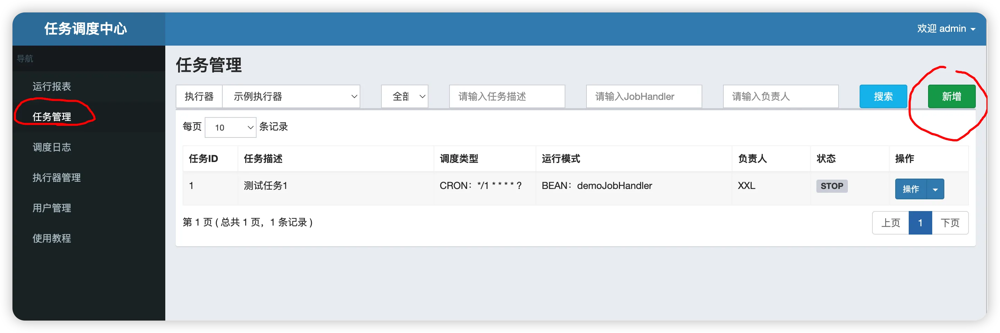
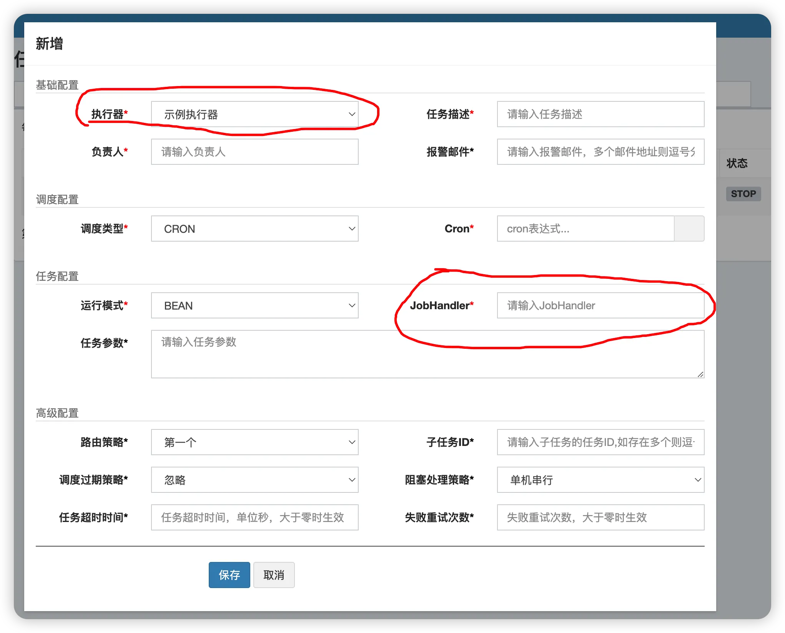

Xxljob所有的定时任务都交给调度中心来调度和维护。在前几章，我为大家引入了定时任务注册的类RegistryParam，现在，我把这个类搬运到这里，大家简单回顾一下。
```java
public class RegistryParam implements Serializable {
    
    private static final long serialVersionUID = 42L;
    
    //定时任务方法的名称
    private String registryKey;
    //定时任务程序部署的服务器的ip地址
    private String registryValue;

    public RegistryParam(){
        
    }
    
    public RegistryParam(String registryKey, String registryValue) {
        this.registryKey = registryKey;
        this.registryValue = registryValue;
    }

    public String getRegistryKey() {
        return registryKey;
    }

    public void setRegistryKey(String registryKey) {
        this.registryKey = registryKey;
    }

    public String getRegistryValue() {
        return registryValue;
    }

    public void setRegistryValue(String registryValue) {
        this.registryValue = registryValue;
    }

}
```
该类中要封装的定时任务信息有两个，一个就是定时任务所在的执行器的IP地址，另一个就是定时任务的名字。

接下来，该怎么创建定时任务呢？其实根据上一章讲解的知识，要把定时任务的方法名称发送给调度中心，就已经很容易分析定时任务的创建思路了。就像下面这样
```java
public class SampleXxlJob {

    public void demoJobHandler() throws Exception {
         System.out.println("执行器的任务开始执行了！");
    }
}
```

在上面的代码块中，我定义了一个类，在该类中定义了一个方法，方法的名称就叫demoJobHandler，该方法就是我要执行的定时任务。

这样一来，当执行器启动之后，是不是就可以把定时任务的方法名称，也就是demoJobHandler封装到RegistryParam中,然后发送给调度中心

但是仅仅这样就够了吗？方法的名称是有了，调度中心远程调度任务的时候会发送TriggerParam对象的信息给执行器，而TriggerParam对象中就封装着要执行的定时任务的方法名称，就像下面这样。
```java
public class TriggerParam implements Serializable{
    private static final long serialVersionUID = 42L;

    //定时任务方法的名字
    private String executorHandler;

    public String getExecutorHandler() {
        return executorHandler;
    }

    public void setExecutorHandler(String executorHandler) {
        this.executorHandler = executorHandler;
    }

}
```
## 执行器侧维护反射信息
如果TriggerParam对象通过http协议发送成功之后，执行器这一端就会接收到这条消息，解码之后就能从TriggerParam对象中获得要执行的定时任务方法的名称。

可是仅仅通过一个方法的名称，怎么就能执行该方法呢？换句话说，方法都是由对象来调用的，现在我们只知道定时任务方法的名称，连它属于哪个对象都不知道，怎么通过对象来调用这个定时任务呢？

很简单，直接使用反射不就行,请看下面的代码块。
```java
//直接用Method对象反射调用定时任务
method.invoke(target);
```

如果是这样的话，那我是不是只需把定时任务的方法名称发送给调度中心就可以了。反正定时任务的方法名称是唯一的。

这样一来，只要在执行器本地把所有定时任务的信息收集一下，让定时任务方法的名字和其Method对象一一对应，然后缓存起来。

比如，就以键值对的形式缓存在一个Map中，那么，当从调度中心发送的消息中得到要执行的定时任务方法的名字后，只需根据要执行的定时任务的名字，从Map中获得对应的Method对象，然后再反射调用该方法，不就可以执行定时任务了吗？

分析到这里，很多朋友可能会提出问题，反射调用方法并不只是拥有Method对象即可，还需要得到目标对象呀。就像上面代码块中写的那样。换句话说，我把定时任务创建在SampleXxlJob对象中了，定时任务的方法名称为demoJobHandler，那么要想执行这个定时任务，SampleXxlJob对象本身和定时任务方法的名字我都需要。

## 反射信息使用何种数据结构来维护？
那么怎么能得到SampleXxlJob对象呢？并且能够让执行器一启动，就把各个定时任务所在的对象都收集起来。因为一个执行器中可能要部署多个定时任务，多个定时任务可能要定义在多个不同的对象中。讲到这里，是不是就意味着终于要引入SpringBoot了？

因为SpringBoot是帮助程序管理对象的最佳帮手。只要在一个类上加上@Component注解，SpringBoot就会为我们创建这个类的单例对象，并且把这些对象收集在单例池中，就像下面这样。
```java
@Component
public class SampleXxlJob {

    public void demoJobHandler() throws Exception {
        System.out.println("执行器的任务开始执行了！");
    }
}
```

Map中的键值对结构，只能是一对一的关系，而定时任务的名称又是唯一的作为key

同时就把定时任务的Method对象和其所在的对象封装进一个新的对象中。然后将定时任务方法的名称和这个新的对象，以键值对的方式缓存到Map中。具体的逻辑请看下面的代码块。

首先定义一个封装定时任务Method对象和其所在的目标对象信息的新类。类的名字就定义为MethodJobHandler。
```java
public class MethodJobHandler{

    //目标类对象，就是用户定义的IOC容器中的bean
    private final Object target;
    //目标方法，就是要被执行的定时任务方法
    private final Method method;

    //构造方法
    public MethodJobHandler(Object target, Method method) {
        this.target = target;
        this.method = method;
    }


    //通过反射执行定时任务方法
    public void execute() throws Exception {
        //没有参数，就直接反射调用方法
        method.invoke(target);
        
    }

    
}
```

上面的对象定义好了之后，执行器端缓存定时任务信息的Map就可以定义成下面这样。
```java
private  static ConcurrentMap<String, MethodJobHandler> jobHandlerRepository = new ConcurrentHashMap<String, MethodJobHandler>();
```

## 引入SpringBoot:SmartInitializingSingleton
可以看到，我使用了一个ConcurrentMap来解决可能出现的并发问题。总之现在好像已经万事俱备，只欠东风了，也就是收集对象，并且把对象缓存到这个ConcurrentMap中。所以，接下来就该引入SpringBoot了。但是在真正引入SpringBoot之前，让我来为大家思考一下，我们引入了Springboot后，究竟要怎么使用它？首先我们肯定要使用SpringBoot为我们把加了@Component注解的单例bean创建出来，但是创建出来的这个单例bean是存放在SpringBoot自己的单例池中的，所以，我们肯定还要获得SpringBoot的容器，从容器中获得用户自己的定义的对象，然后放到执行器自己的ConcurrentMap中。这就是全部的流程了。

当然，既然创建好的对象肯定是要缓存在执行器自己的ConcurrentMap中，就必须要等待SpringBoot容器创建好所有的单例bean后，才能将对象缓存到Map中。

而这一过程肯定要使用到SpringBoot的容器，所以，SpringBoot容器肯定也要被提前获得。

结合这两点，我想我的程序应该在容器中的所有单例bean都创建完之后启动，并且启动的时候可以很轻松就获得SpringBoot的容器，

因此我就可以充分利用SpringBoot的两个扩展点，一个就是ApplicationContextAware接口，另一个就是SmartInitializingSingleton接口，在下面的代码块中有这两个接口具体作用的解释。

我现在定义了一个新的类，叫做XxlJobSpringExecutor，并且就在这个类中实现刚才我为大家分析的编程思路。
```java
public class XxlJobSpringExecutor implements ApplicationContextAware, SmartInitializingSingleton{

    //该成员变量就是由下面的set方法注入的
    private static ApplicationContext applicationContext;

    //该方法就是ApplicationContextAware接口中定义的方法，该方法会在SpringBoot启动的过程中
    //被回调，被回调的时候SpringBoot的容器已经创建了，所以可以直接被赋值到这里，这样
    //XxlJobSpringExecutor类型的对象就可以直接使用SpringBoot的容器了
    @Override
    public void setApplicationContext(ApplicationContext applicationContext) throws BeansException {
        XxlJobSpringExecutor.applicationContext = applicationContext;
    }


	//该方法就是SmartInitializingSingleton接口中定义的方法，该方法会在SpringBoot中的所有
    //单例bean创建完成后被回调，这个时候，SpringBoot的容器已经获得了，所有的单例bean也都创建好了
    //所以就可以在该方法内将创建好的封装定时任务的对象缓存到执行器自己的Map中
    @Override
    public void afterSingletonsInstantiated() {

        //该方法就会把用户定义的所有定时任务注册到MethodJobHandler中，这里的applicationContext是由
        //该类实现的ApplicationContextAware接口帮忙注入的，这个是Spring的基础知识，想必大家应该都清楚
        //这所以需要它，是因为ApplicationContextAware可以得到所有初始化好的单例bean
        initJobHandlerMethodRepository(applicationContext);
    }


    //那这个最核心的方法该如何实现呢？
    private void initJobHandlerMethodRepository(ApplicationContext applicationContext) {
        
    }
}
```

上面代码块的逻辑应该很清晰了，唯一让我感到困扰的就是最核心的那个initJobHandlerMethodRepository方法，在这个最核心的方法中，我要把SpringBoot容器中的所有用来封装定时任务信息的对象，通通转移到执行器自己的Map中。

但是，请大家仔细想想，SpringBoot中的只是bean对象，而我们要存入Map中的是定时任务方法的名称，还有对应的封装着定时任务Method对象与其目标类对象的MethodJobHandler对象，要想获得MethodJobHandler对象，就必须获得定时任务的Method对象与其目标类对象，目标类对象还好说，就是我们从容器中得到的bean本身，那么，Method对象该怎么获得呢？

换句话说，现在我们只是要将和定时任务有关的bean缓存到执行器的Map中，可是在SpringBoot容器中，不止存放着和定时任务有关的bean，有可能还有其他很多单例bean，那该怎么对这两类bean作区分呢？

这种情况，再怎么仔细思索，其实也没什么更好的方法，无非就是给用来当作定时任务的bean的方法添加一个标记，在从容器中获得每一个对象的时候，判断其内部的方法上是否有这个标记即可，如果有就说明是用作定时任务的方法。


## 定义并解析@XxlJob注解
而所谓的标记也无非就是注解，通过反射获得注解然后判断。

这种编程套路，想必大家已经非常熟悉了。比如，就定义一个@XxlJob注解，只要是添加了该注解的方法，就是用做定时任务的方法，并且还可以把定时任务的方法名称定义在注解中，这样在判断SpringBoot容器中所有对象的过程中，定时任务的唯一的方法名称也就获得了。就像下面这样。
```java
@Target({ElementType.METHOD})
@Retention(RetentionPolicy.RUNTIME)
@Inherited
public @interface XxlJob {

    //定时任务的名称
    String value();

}
```

注解如何使用的小例子。
```java
@Component
public class SampleXxlJob {

    //该定时任务的方法名称就是注解中的那个demoJobHandler
    @XxlJob("demoJobHandler")
    public void demoJobHandler() throws Exception {
         System.out.println("执行器的任务开始执行了！");
    }
}
```
接着，就是我自己实现的initJobHandlerMethodRepository方法，请看下面的代码块。
```java
public class XxlJobSpringExecutor implements ApplicationContextAware, SmartInitializingSingleton{

    private static final Logger logger = LoggerFactory.getLogger(XxlJobSpringExecutor.class);
    
    //该成员变量就是由下面的set方法注入的
    private static ApplicationContext applicationContext;

    //该方法就是ApplicationContextAware接口中定义的方法，该方法会在SpringBoot启动的过程中
    //被回调，被回调的时候SpringBoot的容器已经创建了，所以可以直接被赋值到这里，这样
    //XxlJobSpringExecutor类型的对象就可以直接使用SpringBoot的容器了
    @Override
    public void setApplicationContext(ApplicationContext applicationContext) throws BeansException {
        XxlJobSpringExecutor.applicationContext = applicationContext;
    }


	//该方法就是SmartInitializingSingleton接口中定义的方法，该方法会在SpringBoot中的所有
    //单例bean创建完成后被回调，这个时候，SpringBoot的容器已经获得了，所有的单例bean也都创建好了
    //所以就可以在该方法内将创建好的封装定时任务的对象缓存到执行器自己的Map中
    @Override
    public void afterSingletonsInstantiated() {

        //该方法就会把用户定义的所有定时任务注册到MethodJobHandler中，这里的applicationContext是由
        //该类实现的ApplicationContextAware接口帮忙注入的，这个是Spring的基础知识，想必大家应该都清楚
        //这所以需要它，是因为ApplicationContextAware可以得到所有初始化好的单例bean
        initJobHandlerMethodRepository(applicationContext);
    }


    //在该方法内，把容器中的所有对象都获得了，然后依次判断每一个对象中的方法上是否添加着@XxlJob注解
    //如果有这个注解，就说明该方法是用作定时任务的方法，要被进一步处理
    private void initJobHandlerMethodRepository(ApplicationContext applicationContext) {
         if (applicationContext == null) {
            return;
        }
        //获取IOC容器中所有初始化好的bean的名字
        String[] beanDefinitionNames = applicationContext.getBeanNamesForType(Object.class);
        for (String beanDefinitionName : beanDefinitionNames) {
            //根据名称获得每一个bean
            Object bean = applicationContext.getBean(beanDefinitionName);
            //这里定义的变量就是用来收集bean对象中添加了@XxlJob注解的方法了
            //这里大家可以思考一下，难道一个bean对象中只能定义一个定时任务方法吗？
            //显然是可以定义多个的，这也就意味着该对象中可能存在多个添加了@XxlJob注解的方法
            //这也就意味着这该对象内部有多个定时任务方法，既然这样，就会有多个Method对象
            Map<Method, XxlJob> annotatedMethods = null;
            try {
                //下面是Spring自己封装的和反射相关的类，通过下面的操作，可以得到bean对象中所有添加了@XxlJob注解的方法
                //这里我就不详细解释了，大家可以自己去看Spring的源码，这个方法没什么难度的
                //返回的就是添加了注解的方法的Method对象和注解本身，以键值对的形式存放在上面定义的Map
                //中，而这个Map会返回给程序下面使用
                annotatedMethods = MethodIntrospector.selectMethods(bean.getClass(),
                        new MethodIntrospector.MetadataLookup<XxlJob>() {
                            @Override
                            public XxlJob inspect(Method method) {
                                //在这里检查方法是否添加了@XxlJob注解
                                return AnnotatedElementUtils.findMergedAnnotation(method, XxlJob.class);
                            }
                        });
            } catch (Throwable ex) {
                logger.error("xxl-job method-jobhandler resolve error for bean[" + beanDefinitionName + "].", ex);
            }
            //如果结果为空，就说明该bean对象中没有方法添加了@XxlJob注解
            if (annotatedMethods==null || annotatedMethods.isEmpty()) {
                continue;
            }
            //在这里bean对象中每一个添加了@XxlJob注解的方法
            for (Map.Entry<Method, XxlJob> methodXxlJobEntry : annotatedMethods.entrySet()) {
                //得到该方法
                Method executeMethod = methodXxlJobEntry.getKey();
                //得到注解，这里为什么要得到这个注解？别忘了，定时任务方法的名字定义在注解中了
                //所以必须要得到这个注解呀
                XxlJob xxlJob = methodXxlJobEntry.getValue();
                //下面这个方法就是更进一步的核心方法，在该方法中，要把刚才收集到的定时任务的信息
                //封装到MethodJobHandler对象中，并且再把定时任务方法的名字和MethodJobHandler对象
                //缓存到执行器的Map中
                //注意，这里的bean就是目标对象，而executeMethod就是定时任务的Method对象
                //显然，已经可以创建一个完整的MethodJobHandler对象了
                //但是下面这个方法先不做实现
                registJobHandler(xxlJob, bean, executeMethod);
            }
        }
    }
}
```
上面的代码已经实现了很大一部分逻辑了，但是最关键的逻辑，把已经得到的定时任务方法的名称和MethodJobHandler以键值对的形式缓存到执行器的Map中，这个流程还没有实现。该流程要在registJobHandler方法中实现，但在上面的代码块中，我并没有为执行器实现这个方法。

因为我忽然想到一个问题，想跟大家探讨一下。 现在我是把自己的程序集成到SpringBoot中使用了，让SpringBoot帮我创建封装定时任务的bean对象，然后完成后续的操作。就目前完成的代码来看，我的执行器离开了SpringBoot似乎就不能很好的运行了，这就意味着我的执行器只能依附于SpringBoot来执行，这可不是我想要的结果。

如果我构建的分布式定时任务调度框架只能集成在SpringBoot中执行，这不就是个SpringBoot的附属品吗？其实我从一开始就想好了，执行器最终成型后，它既可以集成在SpringBoot中运行，也可以自己单独启动和运行，因此，在上面的代码块中，我才把类名定义为XxlJobSpringExecutor，意味着这是要集成SpringBoot运行的执行器。

除此之外，我还会再定义一个名为XxlJobSimpleExecutor的执行器，这个执行器可以单独启动(这个执行器的具体实现就不在文章中展示了，会放到视频中讲解)。

不过，虽然有两个功能不同的执行器，但也只是创建封装定时任务的对象的方式不同，其他后续的流程，比如把已经得到的定时任务方法的名称和MethodJobHandler以键值对的形式缓存到执行器的Map中，这些后续的流程都是一样的。

所以，我就可以为这两个类引入一个公共父类，将公共的方法定义在父类当中，就比如上面代码块中还未实现的registJobHandler方法。而且这个公共父类，不如就定义成XxlJobExecutor。请看下面的代码块。

## 引入父类XxlJobExecutor，兼容非SpringBoot场景
首先，XxlJobSpringExecutor需要继承父类XxlJobExecutor了。
```java
public class XxlJobSpringExecutor extends XxlJobExecutor implements ApplicationContextAware, SmartInitializingSingleton{
    //内部的方法就省略了
}
```

接着就是XxlJobExecutor类本身。
```java
public class XxlJobExecutor  {


    //存放IJobHandler对象的Map
    private static ConcurrentMap<String, MethodJobHandler> jobHandlerRepository = new ConcurrentHashMap<String, MethodJobHandler>();


    
    //该方法就是用来将用户定义的bean中的每一个定时任务方法都封装到MethodJobHandler对象中的
    protected void registJobHandler(XxlJob xxlJob, Object bean, Method executeMethod){
        //先判断注解是否为空，为空直接返回
        if (xxlJob == null) {
            return;
        }
        //获取注解的名称，这个名称就是用户定义的当前定时任务的名称
        String name = xxlJob.value();
        //得到bean的Class对象
        Class<?> clazz = bean.getClass();
        //获得定时任务方法本身的名称，其实定时任务的名称和注解名称也可以定义为相同的，这个没有限制
        //这个变量会在下面的if分支中，报错时打印一下
        String methodName = executeMethod.getName();
        //对定时任务的名称做判空处理
        if (name.trim().length() == 0) {
            throw new RuntimeException("xxl-job method-jobhandler name invalid, for[" + clazz + "#" + methodName + "] .");
        }
        //从缓存JobHandler的Map中，根据定时任务的名字获取MethodJobHandler
        if (loadJobHandler(name) != null) {
            //如果不为空，说明已经存在相同名字的定时任务了，也有了对应的MethodJobHandler了，所以抛出异常
            throw new RuntimeException("xxl-job jobhandler[" + name + "] naming conflicts.");
        }
        //设置方法可访问
        executeMethod.setAccessible(true);
        //把得到的定时任务的方法对象，以及定时任务的名字，包装一下
        //然后把定时任务的名字和MethodJobHandler对象以键值对的方式缓存在
        //jobHandlerRepository这个Map中
        registJobHandler(name, new MethodJobHandler(bean, executeMethod));
    }


     //在该方法内把键值对缓存到Map中
     public static MethodJobHandler registJobHandler(String name, MethodJobHandler jobHandler){
        return jobHandlerRepository.put(name, jobHandler);
    }

	//根据定时任务的名字获取对应的MethodJobHandler
    public static MethodJobHandler loadJobHandler(String name){
        return jobHandlerRepository.get(name);
    }
}
```

所以，在XxlJobSpringExecutor类的initJobHandlerMethodRepository方法中，程序在执行该方法的最后一行代码registJobHandler(xxlJob, bean, executeMethod)的时候，就会调用到父类XxlJobExecutor中的registJobHandler方法，之后的逻辑在前面已经帮大家梳理过了，就不再重复了。

总之，程序执行到这里，已经把我的执行器启动前的所有准备工作都已经做好了。

用户创建的定时任务都以key-value键值对的形式缓存到一个Map中，Map的键对应的是要执行的定时任务的方法名，其value就是一个MethodJobHandler对象，这个对象中封装着定时任务所在的目标对象和定时任务方法本身的Method对象。

当从调度中心发送过来的TriggerParam对象中获得到要执行的定时任务的名字，就可以根据名字从Map中得到对应的MethodJobHandler对象，然后执行该对象的execute方法，反射调用定时任务。就像下面这样。
```java
/通过反射执行定时任务方法
public void execute() throws Exception {
    //没有参数，就直接反射调用方法
    method.invoke(target);
    
}
```
## 执行器同时作为客户端以及服务端！
到此为止，定时任务被调度中心远程调用的整体逻辑，我就给大家展示完了。当然，这其中还有一些细节后面才会讲到。

但现在，我的执行器构建终于可以进入到一个新的阶段，那就是可以真正启动我的执行器，然后向调度中心发送定时任务的相关信息，换句话说，就是把定时任务本身注册到调度中心，让调度中心把定时任务信息记录在库，

但同时，执行器也要接收调度中心发送过来的信息，执行被调度中心调度的定时任务。

如果是这种情况，请大家想一想，执行器既要发送消息，又要接收消息，这就意味着执行器既要有承担客户端责任的组件，也要有承担服务端责任的组件。
- 客户端用来向调度中心发送消息，也就是把定时任务信息发送给调度中心；
- 服务端用来接收调度中心发送过来的定时任务的调度信息，然后开始执行要被调度的定时任务。

所以，接下来，就让我先为大家仔细分析分析，这两个组件该如何实现。

## 执行器作为客户端
本节只探讨执行器作为客户端的情况。**执行器作为服务器端留在下节课讲（因此本节的执行器还无法接收调度中心的trigger，，也就无法触发反射执行目标任务了）。**

首先，让我们来探讨一下执行器的客户端组件，其实说这个是组件也有点小题大做了，如果仅仅是为了发送消息，就可以干脆沿用前几章的模式，直接使用http协议发送不行了

将封装着定时任务信息的RegistryParam对象序列化之后，通过http发送给调度中心。

调度中心接收到消息后解码，然后将定时任务的信息记录到数据库。

这个本来也挺简单的，但是根据我们刚才讲解的内容，请大家再仔细想想，RegistryParam对象可以封装定时任务的信息，这一点没错，可以把执行器的IP地址和要执行的定时任务的方法名称封装进去，发送给调度中心，

这一切都是建立在这个执行器只有一个定时任务的情况下。但是刚才我向大家分析了，一个执行器实际上是可以部署多个定时任务的，那么现在要把执行器中部署的多个定时任务的信息都发送给执行器，该怎么发送呢？

难道要给执行器的每一个定时任务都封装一个RegistryParam对象吗？这显然是不合适的。那么就把所有要发送的定时任务的名字放到一个集合中，然后封装到RegistryParam对象中，就像下面代码块中写的那样。
```java
public class RegistryParam implements Serializable {
    
    private static final long serialVersionUID = 42L;
    
    //定时任务方法名称的集合
    private List registryKey;
    //定时任务程序部署的服务器的ip地址
    private String registryValue;

    public RegistryParam(){
        
    }
    
    public RegistryParam(List registryKey, String registryValue) {
        this.registryKey = registryKey;
        this.registryValue = registryValue;
    }
}
```

如果把一个执行器中部署的所有定时任务的名字收集起来，放到一个集合中，然后把集合和执行器的IP地址封装到重构过后的RegistryParam对象中，把这个对象发送给调度中心，这么做好像也不是不可以。

没错，确实可以这么做，而且这么做属于目标任务的自动添加，但是xxljob并没有这样做，而是后期由用户手动录入的，请大家回忆下，

手动新增任务：



新增页，下面两个红圈的地方，将要注册的定时任务和执行器绑定起来，JobHandler就是定时任务方法的名字



既然如此，那执行器启动时候向调度中心注册的RegistryParam不是目标任务，那到底是什么？

答案：定时任务的信息实际上并不是由执行器亲自注册的，执行器只是部署了定时任务，把定时任务的反射信息存储在本地的数据结构中，然后把执行器本身的信息通过http发送给调度中心。
```java
public class RegistryParam implements Serializable {
    private static final long serialVersionUID = 42L;

    //注册方式：RegistType{ EXECUTOR, ADMIN }，执行器的注册方法，是手动还是自动（默认都是EXECUTOR自动模式）
    private String registryGroup;
    //执行器的注册名称
    private String registryKey;
    //执行器的地址
    private String registryValue;
```

对应调度中心维护的表结构xxl_job_registry如下：
```sql
CREATE TABLE `xxl_job_registry` (
	`id` INT(11) NOT NULL AUTO_INCREMENT,
	`registry_group` VARCHAR(50) NOT NULL COLLATE 'utf8mb4_general_ci',
	`registry_key` VARCHAR(255) NOT NULL COLLATE 'utf8mb4_general_ci',
	`registry_value` VARCHAR(255) NOT NULL COLLATE 'utf8mb4_general_ci',
	`update_time` DATETIME NULL DEFAULT NULL,
	PRIMARY KEY (`id`) USING BTREE,
	UNIQUE INDEX `i_g_k_v` (`registry_group`, `registry_key`, `registry_value`) USING BTREE
)
COLLATE='utf8mb4_general_ci'
ENGINE=InnoDB
AUTO_INCREMENT=3
;
```
registry_group字段代表注册方式：RegistType{ EXECUTOR, ADMIN }，执行器的注册方法，是手动还是自动（默认都是EXECUTOR自动模式）

registry_value字段用于存储单个执行器实例的地址（例如IP和端口）， 分布式环境中支持多副本执行器，则会在该表中增加多条同执行器的记录，只是registryValue不同

## 本节测试
当前版本代码可以直接运行，

先跑调度中心侧程序，再跑执行器测程序，

验证结果会在xxl_job_registry表中生成新的执行器自身的注册记录
```sql
id;registry_group;registry_key;registry_value;update_time
1;EXECUTOR;xxl-job-executor-sample;http://:9999/;2025-05-09 14:07:27
3;EXECUTOR;xxl-job-executor-sample;http://10.77.182.251:9999/;2025-05-09 14:07:42

```

