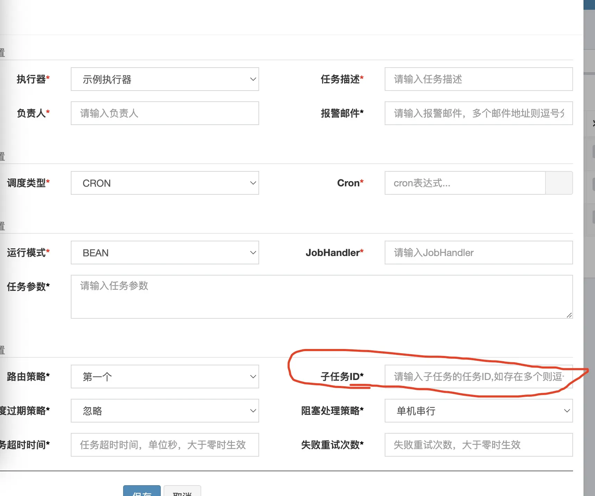

最后一个功能就是子任务的实现，这个也是在web界面设置的。如果一个服务器中部署了两个定时任务1和2，这两个定时任务的信息会被调度中心记录在数据库中，每个定时任务都会对应一个唯一ID。

那如果在web界面，用户非要把2号任务设置成1号任务的子任务，就需要把2号任务的唯一ID填写到子任务ID处。这样这两个任务就具有关系了。



而这种关系的具体表现就是，当1号任务执行成功后，调度中心接收到执行器发来的执行结果信息，这些信息会现在调度中心的JobCompleteHelper类中被处理。请看下面的代码块。

JobCompleteHelper：
```java
/**
 * @author:B站UP主陈清风扬，从零带你写框架系列教程的作者，个人微信号：chenqingfengyang。
 * @Description:系列教程目前包括手写Netty，XXL-JOB，Spring，RocketMq，Javac，JVM等课程。
 * @Date:2023/7/17
 * @Description:调度中心接收执行器回调信息的工作组件
 */
public class JobCompleteHelper {

	private static Logger logger = LoggerFactory.getLogger(JobCompleteHelper.class);
	//单例对象
	private static JobCompleteHelper instance = new JobCompleteHelper();

	public static JobCompleteHelper getInstance(){
		return instance;
	}

	//回调线程池，这个线程池就是处理执行器端回调过来的日志信息的
	private ThreadPoolExecutor callbackThreadPool = null;
	//监控线程
	private Thread monitorThread;
	private volatile boolean toStop = false;


	/**
	 * @author:B站UP主陈清风扬，从零带你写框架系列教程的作者，个人微信号：chenqingfengyang。
	 * @Description:系列教程目前包括手写Netty，XXL-JOB，Spring，RocketMq，Javac，JVM等课程。
	 * @Date:2023/7/17
	 * @Description:启动该组件
	 */
	public void start(){
		//创建回调线程池
		callbackThreadPool = new ThreadPoolExecutor(
				2,
				20,
				30L,
				TimeUnit.SECONDS,
				new LinkedBlockingQueue<Runnable>(3000),
				new ThreadFactory() {
					@Override
					public Thread newThread(Runnable r) {
						return new Thread(r, "xxl-job, admin JobLosedMonitorHelper-callbackThreadPool-" + r.hashCode());
					}
				},
				new RejectedExecutionHandler() {
					@Override
					public void rejectedExecution(Runnable r, ThreadPoolExecutor executor) {
						r.run();
						logger.warn(">>>>>>>>>>> xxl-job, callback too fast, match threadpool rejected handler(run now).");
					}
				});


		//创建监控线程
		monitorThread = new Thread(new Runnable() {
			@Override
			public void run() {
				//这里休息了一会，是因为需要等待JobTriggerPoolHelper组件初始化，因为不执行远程调度，也就没有
				//回调过来的定时任务执行结果信息
				try {
					TimeUnit.MILLISECONDS.sleep(50);
				} catch (InterruptedException e) {
					if (!toStop) {
						logger.error(e.getMessage(), e);
					}
				}
				while (!toStop) {
					try {
						//这里得到了一个时间信息，就是当前时间向前10分钟的时间
						//这里传进去的参数-10，就是减10分钟的意思
						Date losedTime = DateUtil.addMinutes(new Date(), -10);
						//这里最后对应的就是这条sql语句
						//t.trigger_code = 200 AND t.handle_code = 0 AND t.trigger_time <![CDATA[ <= ]]> #{losedTime} AND t2.id IS NULL
						//其实就是判断了一下，现在在数据库中的xxljoblog的触发时间，其实就可以当作定时任务在调度中心开始执行的那个时间
						//这里其实就是把当前时间前十分钟内提交执行的定时任务，但是始终没有得到执行器回调的执行结果的定时任务全找出来了
						//因为t.handle_code = 0，并且注册表中也没有对应的数据了，说明心跳断了
						//具体的方法在XxlJobLogMapper中
						List<Long> losedJobIds  = XxlJobAdminConfig.getAdminConfig().getXxlJobLogDao().findLostJobIds(losedTime);
						if (losedJobIds!=null && losedJobIds.size()>0) {
							//开始遍历定时任务
							for (Long logId: losedJobIds) {
								XxlJobLog jobLog = new XxlJobLog();
								jobLog.setId(logId);
								//设置执行时间
								jobLog.setHandleTime(new Date());
								//设置失败状态
								jobLog.setHandleCode(ReturnT.FAIL_CODE);
								jobLog.setHandleMsg( I18nUtil.getString("joblog_lost_fail") );
								//更新失败的定时任务状态
								XxlJobCompleter.updateHandleInfoAndFinish(jobLog);
							}
						}
					}
					catch (Exception e) {
						if (!toStop) {
							logger.error(">>>>>>>>>>> xxl-job, job fail monitor thread error:{}", e);
						}
					}
                    try {
						//每60秒工作一次
                        TimeUnit.SECONDS.sleep(60);
                    } catch (Exception e) {
                        if (!toStop) {
                            logger.error(e.getMessage(), e);
                        }
                    }
                }
				logger.info(">>>>>>>>>>> xxl-job, JobLosedMonitorHelper stop");
			}
		});
		monitorThread.setDaemon(true);
		monitorThread.setName("xxl-job, admin JobLosedMonitorHelper");
		monitorThread.start();
	}


	//终止组件工作的方法
	public void toStop(){
		toStop = true;
		callbackThreadPool.shutdownNow();
		monitorThread.interrupt();
		try {
			monitorThread.join();
		} catch (InterruptedException e) {
			logger.error(e.getMessage(), e);
		}
	}


	/**
	 * @author:B站UP主陈清风扬，从零带你写框架系列教程的作者，个人微信号：chenqingfengyang。
	 * @Description:系列教程目前包括手写Netty，XXL-JOB，Spring，RocketMq，Javac，JVM等课程。
	 * @Date:2023/7/17
	 * @Description:处理回调信息的方法
	 */
	public ReturnT<String> callback(List<HandleCallbackParam> callbackParamList) {
		callbackThreadPool.execute(new Runnable() {
			@Override
			public void run() {
				for (HandleCallbackParam handleCallbackParam: callbackParamList) {
					//在这里处理每一个回调的信息
					ReturnT<String> callbackResult = callback(handleCallbackParam);
					logger.debug(">>>>>>>>> JobApiController.callback {}, handleCallbackParam={}, callbackResult={}",
							(callbackResult.getCode()== ReturnT.SUCCESS_CODE?"success":"fail"), handleCallbackParam, callbackResult);
				}
			}
		});

		return ReturnT.SUCCESS;
	}


	/**
	 * @author:B站UP主陈清风扬，从零带你写框架系列教程的作者，个人微信号：chenqingfengyang。
	 * @Description:系列教程目前包括手写Netty，XXL-JOB，Spring，RocketMq，Javac，JVM等课程。
	 * @Date:2023/7/17
	 * @Description:真正处理回调信息的方法
	 */
	private ReturnT<String> callback(HandleCallbackParam handleCallbackParam) {
		//得到对应的xxljoblog对象
		XxlJobLog log = XxlJobAdminConfig.getAdminConfig().getXxlJobLogDao().load(handleCallbackParam.getLogId());
		if (log == null) {
			return new ReturnT<String>(ReturnT.FAIL_CODE, "log item not found.");
		}
		//判断日志对象的处理结果码
		//因为这个响应码无论是哪种情况都是大于0的，如果大于0了，说明已经回调一次了
		//如果等于0，说明还没得到回调信息，任务也可能还处于运行中状态
		if (log.getHandleCode() > 0) {
			return new ReturnT<String>(ReturnT.FAIL_CODE, "log repeate callback.");
		}
		//拼接信息
		StringBuffer handleMsg = new StringBuffer();
		if (log.getHandleMsg()!=null) {
			handleMsg.append(log.getHandleMsg()).append("<br>");
		}
		if (handleCallbackParam.getHandleMsg() != null) {
			handleMsg.append(handleCallbackParam.getHandleMsg());
		}
		log.setHandleTime(new Date());
		log.setHandleCode(handleCallbackParam.getHandleCode());
		log.setHandleMsg(handleMsg.toString());
		//更新数据库中的日志信息
		XxlJobCompleter.updateHandleInfoAndFinish(log);
		return ReturnT.SUCCESS;
	}
}
```

从上面的代码块中可以看到，不管定时任务执行成功或者是失败，都需要XxlJobCompleter这个类来更新数据库的信息。而XxlJobCompleter类的具体内容如下。

XxlJobCompleter:
```java
/**
 * @author:B站UP主陈清风扬，从零带你写框架系列教程的作者，个人微信号：chenqingfengyang。
 * @Description:系列教程目前包括手写Netty，XXL-JOB，Spring，RocketMq，Javac，JVM等课程。
 * @Date:2023/7/17
 * @Description:更新日志信息，触发子任务的类
 */
public class XxlJobCompleter {

    private static Logger logger = LoggerFactory.getLogger(XxlJobCompleter.class);


    public static int updateHandleInfoAndFinish(XxlJobLog xxlJobLog) {
        //触发子任务的方法
        finishJob(xxlJobLog);
        //判断字符串长度
        if (xxlJobLog.getHandleMsg().length() > 15000) {
            //太长的话需要截取一段
            xxlJobLog.setHandleMsg( xxlJobLog.getHandleMsg().substring(0, 15000) );
        }
        //更新数据库
        return XxlJobAdminConfig.getAdminConfig().getXxlJobLogDao().updateHandleInfo(xxlJobLog);
    }


   /**
    * @author:B站UP主陈清风扬，从零带你写框架系列教程的作者，个人微信号：chenqingfengyang。
    * @Description:系列教程目前包括手写Netty，XXL-JOB，Spring，RocketMq，Javac，JVM等课程。
    * @Date:2023/7/17
    * @Description:触发子任务的方法
    */
    private static void finishJob(XxlJobLog xxlJobLog){
        String triggerChildMsg = null;
        //先判断定时任务是不是执行成功的状态
        if (XxlJobContext.HANDLE_CODE_SUCCESS == xxlJobLog.getHandleCode()) {
            //如果成功了，就先得到该定时任务的具体信息
            XxlJobInfo xxlJobInfo = XxlJobAdminConfig.getAdminConfig().getXxlJobInfoDao().loadById(xxlJobLog.getJobId());
            //判断子任务id不为null
            if (xxlJobInfo!=null && xxlJobInfo.getChildJobId()!=null && xxlJobInfo.getChildJobId().trim().length()>0) {
                triggerChildMsg = "<br><br><span style=\"color:#00c0ef;\" > >>>>>>>>>>>"+ I18nUtil.getString("jobconf_trigger_child_run") +"<<<<<<<<<<< </span><br>";
                //如果有多个子任务，就切分子任务id为数组
                String[] childJobIds = xxlJobInfo.getChildJobId().split(",");
                //遍历子任务id数组
                for (int i = 0; i < childJobIds.length; i++) {
                    //得到子任务id
                    int childJobId = (childJobIds[i]!=null && childJobIds[i].trim().length()>0 && isNumeric(childJobIds[i]))?Integer.valueOf(childJobIds[i]):-1;
                    if (childJobId > 0) {
                        //在这里直接调度子任务
                        JobTriggerPoolHelper.trigger(childJobId, TriggerTypeEnum.PARENT, -1, null, null, null);
                        //设置调度成功的结果
                        ReturnT<String> triggerChildResult = ReturnT.SUCCESS;
                        triggerChildMsg += MessageFormat.format(I18nUtil.getString("jobconf_callback_child_msg1"),
                                (i+1),
                                childJobIds.length,
                                childJobIds[i],
                                (triggerChildResult.getCode()==ReturnT.SUCCESS_CODE?I18nUtil.getString("system_success"):I18nUtil.getString("system_fail")),
                                triggerChildResult.getMsg());
                    } else {
                        triggerChildMsg += MessageFormat.format(I18nUtil.getString("jobconf_callback_child_msg2"),
                                (i+1),
                                childJobIds.length,
                                childJobIds[i]);
                    }
                }
            }
        }
        if (triggerChildMsg != null) {
            xxlJobLog.setHandleMsg( xxlJobLog.getHandleMsg() + triggerChildMsg );
        }
    }


    private static boolean isNumeric(String str){
        try {
            int result = Integer.valueOf(str);
            return true;
        } catch (NumberFormatException e) {
            return false;
        }
    }

}
```

可以看到，在XxlJobCompleter类更新数据库的信息之前，还会执行finishJob(xxlJobLog);这个方法。在该方法中，就会根据子任务ID，也就是2号定时任务的ID，去调度2号定时任务。

这样一来，就体现出一种关系，那就是父任务一旦执行完成，子任务就自动执行了。说白了，更像是一种回调函数。原理大同小异，逻辑简简单单，这就是一个完整的xxl-job定时任务调度框架。

## 本节测试

启动admin服务

启动sample服务

会发现执行器地址已经注册到执行器注册表`xxl_job_registry`中了
```sql
id;registry_group;registry_key;registry_value;update_time
1;EXECUTOR;xxl-job-executor-sample;http://:9999/;2025-05-09 14:07:27
5;EXECUTOR;xxl-job-executor-sample;http://10.77.182.251:9999/;2025-05-12 10:49:13
```

本节你可以删除xxl_job_group表中的address_list地址字段值，来验证调度中心能够自动的同步xxl_job_registry执行器的地址并注册到到xxl_job_group

自己定义两个任务用来测试
```java
    /**
     * 4、子任务示例（Bean模式）
     */
    @XxlJob("fatherHandler")
    public void fatherHandler() throws Exception {
        System.out.println("fatherHandler！");
        for (int i = 0; i < 5; i++) {
            System.out.println("第"+i+"次");
        }
    }

    /**
     * 5、子任务示例（Bean模式）
     */
    @XxlJob("childHandler")
    public void childHandler() throws Exception {
        System.out.println("我是fatherHandler的子任务：childHandler！");
        for (int i = 0; i < 5; i++) {
            System.out.println("第"+i+"次");
        }
    }
```

手动在admin管理页面录入这两个任务，此时数据库信息如下：
- 父任务id为8
- 子任务id为7（因为我先录入的子任务，自然id就是小的）
```shell
id;job_group;job_desc;add_time;update_time;author;alarm_email;schedule_type;schedule_conf;misfire_strategy;executor_route_strategy;executor_handler;executor_param;executor_block_strategy;executor_timeout;executor_fail_retry_count;glue_type;glue_source;glue_remark;glue_updatetime;child_jobid;trigger_status;trigger_last_time;trigger_next_time
7;1;父任务的子任务;2025-05-15 13:45:40;2025-05-15 13:47:31;XXL;;CRON;0 0 0 * * ? *;DO_NOTHING;FIRST;childHandler;;SERIAL_EXECUTION;0;0;BEAN;;GLUE代码初始化;2025-05-15 13:45:40;;0;0;0
8;1;父任务;2025-05-15 13:47:43;2025-05-15 13:48:22;XXL;;CRON;0 0 0 * * ? *;DO_NOTHING;FIRST;fatherHandler;;SERIAL_EXECUTION;0;0;BEAN;;GLUE代码初始化;2025-05-15 13:47:43;7;0;0;0
```
并且在页面中编辑父任务信息，指定子任务号为7.

这时手动触发父任务, 测试打印信息如下，输出于执行器侧本地：


```shell
13:49:09.538 logback [xxl-job, EmbedServer bizThreadPool-1917561947] INFO  c.c.x.j.core.executor.XxlJobExecutor - >>>>>>>>>>> xxl-job regist JobThread success, jobId:8, handler:com.cqfy.xxl.job.core.handler.impl.MethodJobHandler@664632e9[class com.xxl.job.executor.jobhandler.SampleXxlJob#fatherHandler]
fatherHandler！
第0次
第1次
第2次
第3次
第4次
13:49:16.966 logback [xxl-job, EmbedServer bizThreadPool-1917561947] INFO  c.c.x.j.core.executor.XxlJobExecutor - >>>>>>>>>>> xxl-job regist JobThread success, jobId:7, handler:com.cqfy.xxl.job.core.handler.impl.MethodJobHandler@494c8f29[class com.xxl.job.executor.jobhandler.SampleXxlJob#childHandler]
我是fatherHandler的子任务：childHandler！
第0次
第1次
第2次
第3次
第4次

```